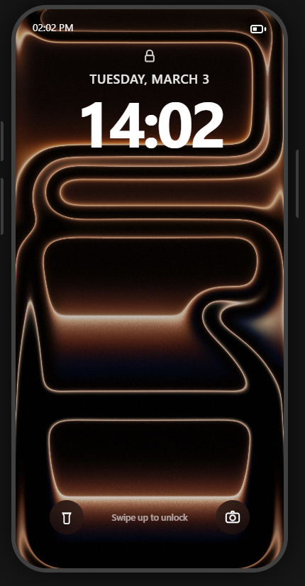
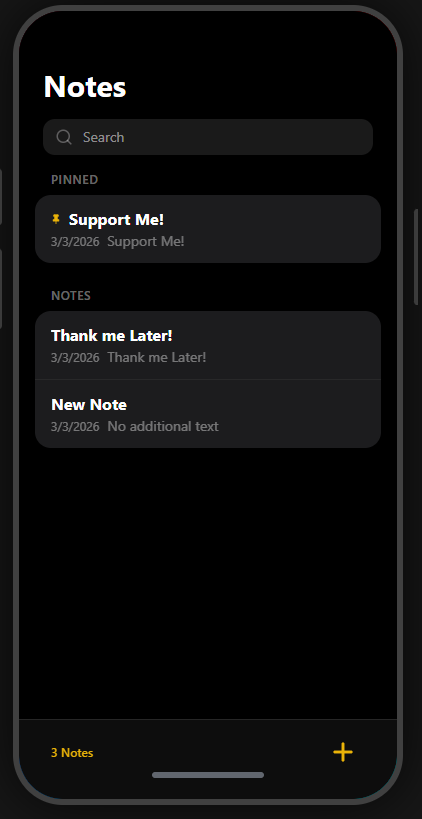
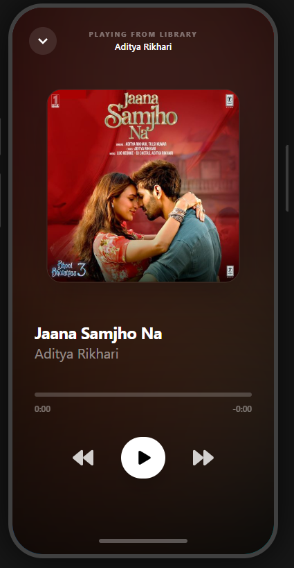
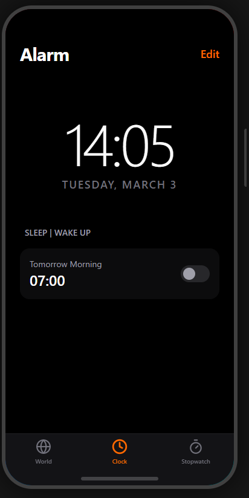

# 📱 AnshPhantomOS – iOS Inspired Web Operating System

A fully interactive iOS-inspired web operating system built with React.
Featuring real app logic, animations, gestures, state management, and persistent storage.

🌐 **Live Demo:**
👉 https://anshphantom.netlify.app

---

## 👨‍💻 Developer

**AnshCoder – Ansh Sharma**

Full Stack MERN Developer
Built with passion, late nights, and serious UI obsession.

---

## 🚀 Overview

AnshPhantomOS is a browser-based operating system simulation that replicates the iOS experience using modern web technologies.

This project includes:

* Lock Screen with Passcode System - passcode use - 2011
* Control Center with toggles and sliders
* Draggable App Windows
* Persistent Notes App
* Music Player
* Safari Wikipedia
* Calculator
* Dummy Phone App
* Woking Camera
* Photos Saved in Photos
* Working Maps
* Clock App (Digital + World Clock + Stopwatch)
* Smooth Framer Motion animations
* Zustand state management
* LocalStorage data persistence

---

## ✨ Features

### 🔐 Lock Screen

* 4-digit passcode - 2011
* Unlock animation
* Secure state handling

### 📱 App System

* Dynamic app opening and closing
* Drag-down gesture to close apps
* Smooth iOS-style transitions

### 🎛 Control Center

* WiFi toggle
* Bluetooth toggle
* Airplane Mode
* Rotation Lock
* Torch
* Dark Mode
* Small Music Player
* Brightness slider
* Volume slider

### 🎵 Music Player

* Song switching
* Play / Pause
* Persistent state
* Cover art support

### 📝 Notes App

* Create notes
* Edit notes
* Delete notes
* Auto title from first line
* Saved in localStorage
* Real-time UI updates

### 🕒 Clock App

* Live Digital Clock
* World Clock (multiple timezones)
* Fully working Stopwatch
* Tab navigation

---

## 🛠 Tech Stack

* React
* Zustand (State Management)
* Framer Motion (Animations & Gestures)
* Tailwind CSS
* LocalStorage API
* JavaScript (ES6+)

---

## 📸 Screenshots

> Replace the image paths below with your actual screenshots

### 🏠 Home Screen



### 📝 Notes App



### 🎵 Music Player



### 🕒 Clock App



 * And Many more features and Apps you should explore by tapping the url given

---

## 🧠 Architecture Highlights

* Centralized Zustand store managing:

  * App state
  * Lock state
  * Control Center
  * Music player
  * Notes data
* Modular app structure
* Reusable gesture logic
* Clean component separation
* Persistent storage strategy

---

## 📂 Project Structure

```
src/
 ├── apps/
 │    ├── Notes/
 │    ├── Clock/
 │    ├── Music/
 │    ├── Phone/
 │    ├── Calculator/
 │    ├── Camera/
 │    ├── Maps/
 │    ├── Photos/
 │
 ├── components/
 │    ├── system/
 │    ├── ui/
 │
 ├── store/
 │    └── useOSStore.js
```

---

## 💡 Future Improvements

* Alarm system with real sound notifications
* Camera simulation
* Weather app with API
* Multi-app stack (recent apps view)
* Dynamic wallpapers
* App minimization animation
* Real iOS-style blur effects

---

## 🔥 Why This Project Matters

This project demonstrates:

* Advanced state handling
* Real UI architecture design
* Animation control
* App lifecycle management
* Clean frontend system design

It’s not just a UI clone — it’s a working interactive OS simulation.

---

## 📜 License

This project is open-source and built for learning and demonstration purposes.

---

## ⭐ Contact

* Email: anshsharma20118@gmail.com
* LinkedIn: [Ansh Sharma](https://www.linkedin.com/in/ansh-sharma-2011/)
* GitHub: [AnshCoder](https://github.com/AnshCoder2011)

## ⭐ Support

If you like this project, give it a star ⭐
More crazy builds coming soon.

Built with focus, discipline, and caffeine.

**– AnshCoder**
